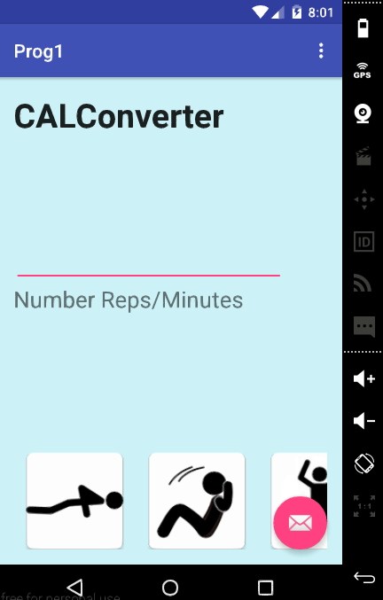
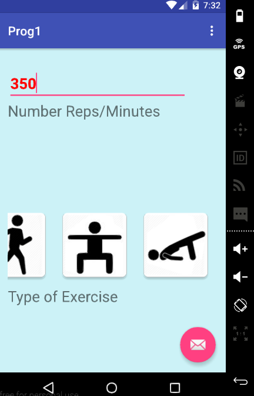
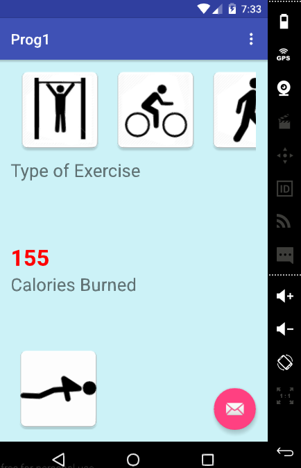
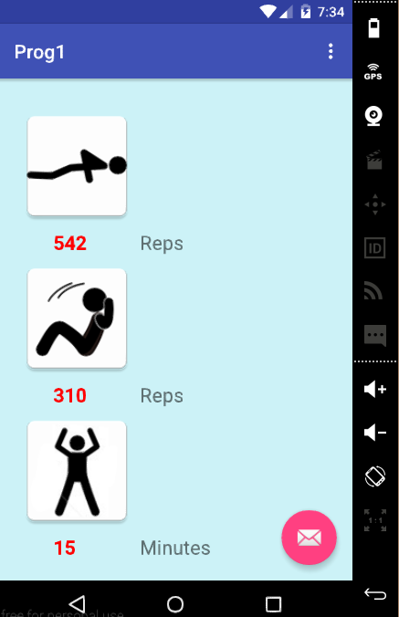
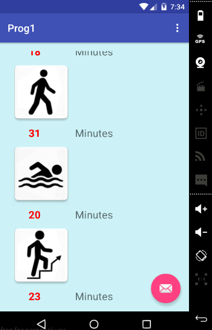

# PROG 01: Crunch Time

The CALConverter application allows users to enter the amount of a certain type of exercise, and quickly learn how many calories they've burned,
as well as the equivalent amounts in other forms of activities.

To use the app, simply enter the number of repetitions or minutes of exercise you have performed, then select the type of exercise in the buttons below.

The exercise buttons are contained in a scrollable bar, so simply swipe the options left or right until you see the exercise you are looking for.

Upon selecting the type of exercise, the number of calories you have burned will appear underneath, followed by a list of equivalent exercises.
Simply scroll down until you find the information you are looking for. Then you can return to the top and re-select your next exercise choice as you please.

## Authors

David Ni ([david.ni@berkeley.edu](david.ni@berkeley.edu))

## Demo Video

See [CALConverter Demo ] (https://youtu.be/bqQcPfUvwMA)

## Screenshots

## Acknowledgments

Big thanks to the Stack Overflow community, for teach me how to Java gooder.
